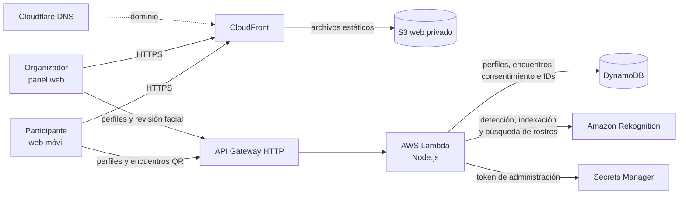

# Arquitectura de comunid.app

Diagrama 16:9 para charla: [SVG](arquitectura-charla.svg) · [PNG](arquitectura-charla.png). El SVG se regenera con `python3 docs/generar-arquitectura.py`.

**Cómo contarlo:** CloudFront sirve las tres interfaces estáticas desde S3. El teléfono lee el QR en el navegador y envía el encuentro a la API; Lambda lo guarda en DynamoDB. El panel de organizadores revisa fotos y consentimiento antes de indexar rostros en Rekognition. La imagen grupal original permanece en el navegador durante esa revisión; la API no la conserva.

**Estado de la implementación:** la app móvil también funciona como demo local con perfiles curados y `localStorage` cuando no hay API configurada. La selfie del encuentro se mantiene en el navegador. El reconocimiento facial pertenece hoy al panel de organizadores, no al flujo del participante.

**Infraestructura adicional:** ACM provee el certificado TLS; GitHub Actions usa OIDC para despliegues definidos con Terraform. Staging y producción son entornos separados. El bucket privado de medios existe en Terraform, pero no forma parte del flujo principal representado aquí.
