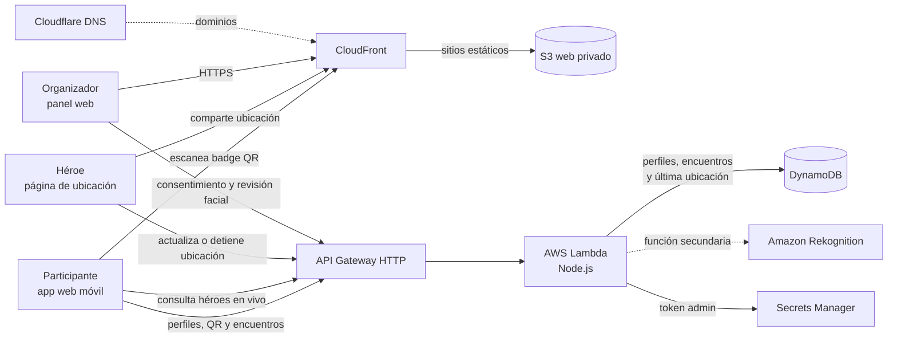

# Arquitectura de comunid.app

Diagrama 16:9 para charla: [SVG](arquitectura-charla.svg) · [PNG](arquitectura-charla.png). Regenerá el SVG con `python3 docs/generar-arquitectura.py` y el PNG con `rsvg-convert -w 1920 -h 1080 docs/arquitectura-charla.svg -o docs/arquitectura-charla.png`.

**Cómo contarlo:** CloudFront entrega las interfaces web desde un bucket S3 privado. En el evento, una persona escanea el QR del badge; la app abre el perfil y registra el encuentro mediante API Gateway, Lambda y DynamoDB. Quienes comparten ubicación lo hacen desde su página de héroe con un enlace privado. La app consulta la API cada 30 segundos; solo muestra ubicaciones actualizadas en los últimos dos minutos. La persona puede detener el uso compartido y no se guarda un recorrido histórico.

**Centro del producto:** conectar personas en el evento mediante sus QR y ayudar a encontrar a los héroes que comparten dónde están. Rekognition permanece como herramienta opcional del panel organizador: la detección e indexación de rostros requiere consentimiento y no participa del flujo del asistente.

**Implementación:** la app móvil y las páginas web también pueden ejecutarse en modo demo local. Cuando no hay API configurada, perfiles y encuentros usan datos curados y `localStorage`. La selfie del encuentro permanece en el navegador. GitHub Actions usa OIDC y Terraform para publicar los sitios y recursos AWS; ACM provee TLS. El bucket privado de medios está provisionado, pero no aparece en el flujo de producto.
